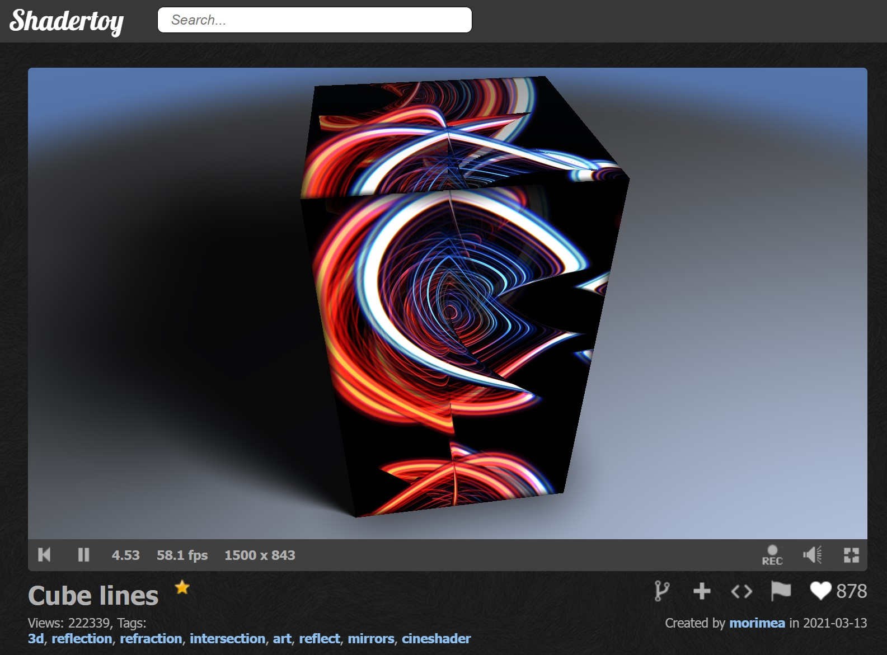
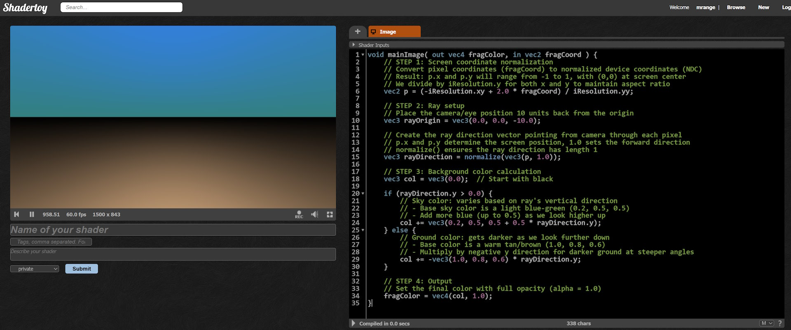
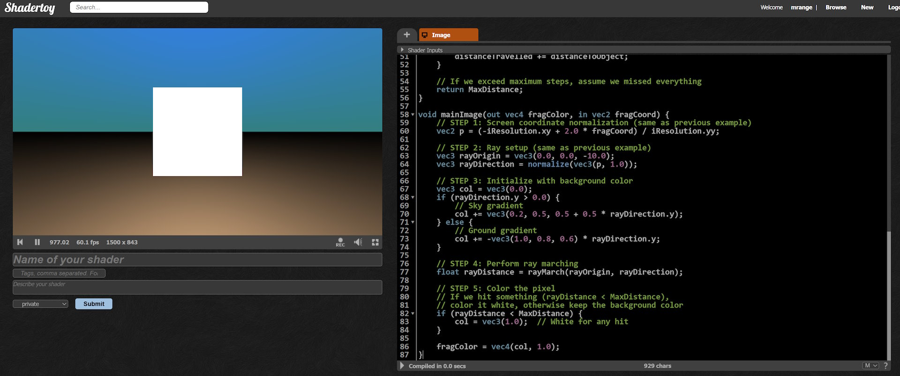
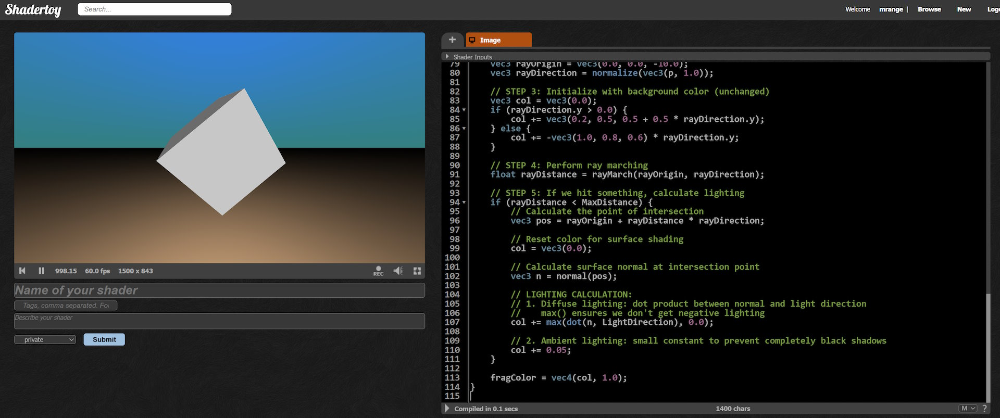
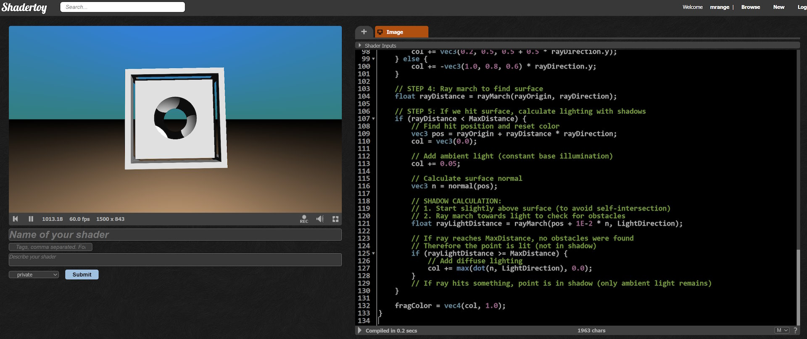
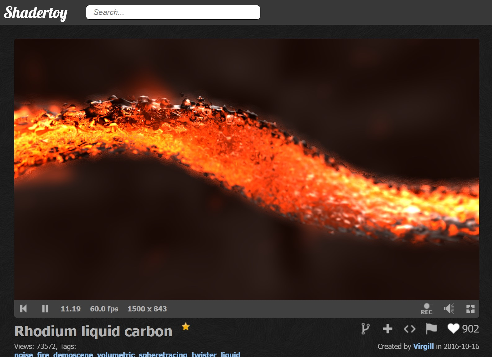

# 🎄⭐🎉 Introduction to Ray Marching 🎉⭐🎄

🎅 Ho, ho, ho! Merry Shader-mas! 🎅

## 🎄 Wait... *Another* Ray Marching Blog Post? 🎄

Yes, yes, I know—there are plenty of blog posts on ray marching out there. It's a bit like the programming equivalent of a Christmas fruitcake: everyone who gets a taste of it has to make their own version!

So why add one more? Well, if you’ve ever browsed [ShaderToy](https://www.shadertoy.com/) and found yourself dazzled (or mystified) by those mind-bending shaders, understanding ray marching is like having the recipe. Once you get it, everything starts to click because so many ShaderToy examples are built around it.



### So, what *is* Ray Marching?

A ray marcher is a type of ray tracer, but it uses distance fields to define and render 3D objects. Imagine tracing a line through a scene, but instead of traditional rendering, we’re checking distances to objects, step by step, until we hit something (or not).

Let’s jump in and build one together. If you're ready, create a [new shader on ShaderToy](https://www.shadertoy.com/new) so we can start from scratch!

## 🌠 Setting Up the Ray 🌠

To trace a ray through our scene, we need two things: a **ray origin** and a **ray direction vector**.

- **Ray Origin**: This one’s easy—we’ll start from `(0, 0, -10)`, a good spot to visualize things.
- **Ray Direction**: Here, we’ve got options, but one simple way to get the direction vector is the following:

```glsl
// Create the ray direction vector pointing from camera through each pixel
// p.x and p.y determine the screen position, 1.0 sets the forward direction
// normalize() ensures the ray direction has length 1
vec3 rayDirection = normalize(vec3(p, 1.0));
```

Here's the complete example:

```glsl
void mainImage( out vec4 fragColor, in vec2 fragCoord ) {
    // STEP 1: Screen coordinate normalization
    // Convert pixel coordinates (fragCoord) to normalized device coordinates (NDC)
    // Result: p.x and p.y will range from -1 to 1, with (0,0) at screen center
    // We divide by iResolution.y for both x and y to maintain aspect ratio
    vec2 p = (-iResolution.xy + 2.0 * fragCoord) / iResolution.yy;

    // STEP 2: Ray setup
    // Place the camera/eye position 10 units back from the origin
    vec3 rayOrigin = vec3(0.0, 0.0, -10.0);

    // Create the ray direction vector pointing from camera through each pixel
    // p.x and p.y determine the screen position, 1.0 sets the forward direction
    // normalize() ensures the ray direction has length 1
    vec3 rayDirection = normalize(vec3(p, 1.0));

    // STEP 3: Background color calculation
    vec3 col = vec3(0.0);  // Start with black

    if (rayDirection.y > 0.0) {
        // Sky color: varies based on ray's vertical direction
        // - Base sky color is a light blue-green (0.2, 0.5, 0.5)
        // - Add more blue (up to 0.5) as we look higher up
        col += vec3(0.2, 0.5, 0.5 + 0.5 * rayDirection.y);
    } else {
        // Ground color: gets darker as we look further down
        // - Base color is a warm tan/brown (1.0, 0.8, 0.6)
        // - Multiply by negative y direction for darker ground at steeper angles
        col += -vec3(1.0, 0.8, 0.6) * rayDirection.y;
    }

    // STEP 4: Output
    // Set the final color with full opacity (alpha = 1.0)
    fragColor = vec4(col, 1.0);
}
```



## ✂️ Learning to Copy and Paste from IQ's Site 📋

Now, let’s take a big step forward and define a **distance field** for the object we want to ray trace. There are plenty of ways to do this, but why not borrow the brilliant `sdBox` function from [IQ’s amazing collection of distance field functions](https://iquilezles.org/articles/distfunctions/)? After all, sharing is caring!

```glsl
// Signed Distance Function (SDF) for a box
// Source: https://iquilezles.org/articles/distfunctions/
// Parameters:
//   p: point in 3D space to evaluate
//   b: box dimensions (half-lengths in x, y, z)
// Returns: negative inside box, 0 on surface, positive outside
float sdBox(vec3 p, vec3 b) {
    vec3 q = abs(p) - b;
    return length(max(q, 0.0)) + min(max(q.x, max(q.y, q.z)), 0.0);
}
```

So, how does this distance field function work? Essentially, for any given point in space, it calculates the distance to the object. If the result is positive, we’re outside the object; if it’s negative, we’re inside; and if it’s zero, we’re right on the surface. Simple enough, right?

With this distance field in hand, we can finally create our ray marcher! The process is pretty straightforward: we start at the ray origin and use our distance field function to check the distance to the object. If we’re “close enough” to hit the object, we stop. If we’ve iterated too many times or traveled beyond a set maximum distance, we stop there as well. Otherwise, we continue moving in the ray direction based on the distance we calculated, repeating this process until we find our target!

Here is the full example:

```glsl
// Maximum distance a ray can travel before we consider it a "miss"
const float MaxDistance = 20.0;

// Signed Distance Function (SDF) for a box
// Source: https://iquilezles.org/articles/distfunctions/
// Parameters:
//   p: point in 3D space to evaluate
//   b: box dimensions (half-lengths in x, y, z)
// Returns: negative inside box, 0 on surface, positive outside
float sdBox(vec3 p, vec3 b) {
    vec3 q = abs(p) - b;
    return length(max(q, 0.0)) + min(max(q.x, max(q.y, q.z)), 0.0);
}

// Distance Field Function
// This defines the "scene" by returning the distance from any point
// to the nearest surface. Can be made more complex by combining multiple SDFs
float map(vec3 p) {
    // Create a box centered at origin with half-lengths of 3.0
    return sdBox(p, vec3(3.0));
}

// Ray Marching Function
// Moves along the ray in steps until hitting an object or reaching max distance
// Parameters:
//   rayOrigin: starting point of the ray
//   rayDirection: normalized direction of the ray
// Returns: distance traveled (MaxDistance if no hit)
float rayMarch(vec3 rayOrigin, vec3 rayDirection) {
    // Keep track of total distance traveled along the ray
    float distanceTravelled = 0.0;

    // Maximum number of steps to prevent infinite loops
    for (int i = 0; i < 80; ++i) {
        // STEP 1: Calculate current position along the ray
        vec3 pos = rayOrigin + rayDirection * distanceTravelled;

        // STEP 2: Get distance to nearest surface at current position
        float distanceToObject = map(pos);

        // STEP 3: Check termination conditions
        // We've hit something (very close to surface) OR
        // We've gone too far (missed everything)
        if (distanceToObject < 1E-3 || distanceTravelled >= MaxDistance) {
            return distanceTravelled;
        }

        // STEP 4: March forward
        // We can safely move forward by the distance to the nearest surface
        // (because no surface can be closer than this distance)
        distanceTravelled += distanceToObject;
    }

    // If we exceed maximum steps, assume we missed everything
    return MaxDistance;
}

void mainImage(out vec4 fragColor, in vec2 fragCoord) {
    // STEP 1: Screen coordinate normalization (same as previous example)
    vec2 p = (-iResolution.xy + 2.0 * fragCoord) / iResolution.yy;

    // STEP 2: Ray setup (same as previous example)
    vec3 rayOrigin = vec3(0.0, 0.0, -10.0);
    vec3 rayDirection = normalize(vec3(p, 1.0));

    // STEP 3: Initialize with background color
    vec3 col = vec3(0.0);
    if (rayDirection.y > 0.0) {
        // Sky gradient
        col += vec3(0.2, 0.5, 0.5 + 0.5 * rayDirection.y);
    } else {
        // Ground gradient
        col += -vec3(1.0, 0.8, 0.6) * rayDirection.y;
    }

    // STEP 4: Perform ray marching
    float rayDistance = rayMarch(rayOrigin, rayDirection);

    // STEP 5: Color the pixel
    // If we hit something (rayDistance < MaxDistance),
    // color it white, otherwise keep the background color
    if (rayDistance < MaxDistance) {
        col = vec3(1.0);  // White for any hit
    }

    fragColor = vec4(col, 1.0);
}
```



## 🧊 Computers Are Made for Rotating Cubes 🧊

Right now, all we see is a white square against a sky-blue background, but trust me—this is supposed to be a 3D box! To make our box stand out as a true cube, we need to rotate it a bit.

We can achieve this using a handy helper function that rotates our 2D coordinates. Here’s the magic:

```glsl
// 2D Rotation Function
// Rotates a 2D point 'p' by angle 'a' (in radians) around origin
// Parameters:
//   p: point to rotate (modified in-place using inout)
//   a: angle in radians
void rot(inout vec2 p, float a) {
    // Standard 2D rotation matrix multiplication:
    // [cos(a) -sin(a)] [x]
    // [sin(a)  cos(a)] [y]
    float c = cos(a);
    float s = sin(a);
    p = vec2(c * p.x + s * p.y, -s * p.x + c * p.y);
}
```

Now that we've got our rotation function, let's tweak the `map` function to introduce some time-based rotation. This will give our cube a dynamic feel:

```glsl
// Distance Field Function with rotation
// Now includes rotation in XY and XZ planes for animated movement
float map(vec3 p) {
    // Rotate in XY plane using current time
    rot(p.xy, iTime);
    // Rotate in XZ plane at different speed (0.707 ≈ 1/√2 for variety)
    rot(p.xz, iTime * 0.707);
    // Return distance to a box of size 3.0
    return sdBox(p, vec3(3.0));
}
```

With these changes, our cube will now spin and reveal its true 3D form. After all, computers are made to rotate cubes!

## ⬅️ Shading Cubes Is Only Normal ➡️

If all goes well, you should be seeing a white cube spinning around. Cool, but let’s kick it up a notch with some shading! To make our cube truly pop, we need to compute the **normal** of its surface. A normal is a vector that’s perpendicular to the surface, and it’s absolutely essential for most shading techniques.

Now, here’s the tricky part: understanding the `normal` function might seem daunting. But don’t worry! You don’t have to master it; just know that almost all shaders use a version like this:

```glsl
// Calculate Surface Normal
// Uses central differences method to approximate the gradient of the distance field
// Parameters:
//   pos: point on the surface where we want to calculate the normal
// Returns: normalized vector perpendicular to the surface
vec3 normal(vec3 pos) {
    // Small offset for numerical differentiation
    vec2 eps = vec2(1E-2, 0.0);  // x = epsilon, y = 0

    // Calculate the gradient using central differences
    // For each axis, we:
    // 1. Sample the distance field slightly ahead (pos + eps)
    // 2. Sample the distance field slightly behind (pos - eps)
    // 3. Take the difference to approximate the derivative
    return normalize(vec3(
        map(pos + eps.xyy) - map(pos - eps.xyy),  // x-axis gradient
        map(pos + eps.yxy) - map(pos - eps.yxy),  // y-axis gradient
        map(pos + eps.yyx) - map(pos - eps.yyx)   // z-axis gradient
    ));
}
```

This function calculates the normal by checking how the distance changes around the point `pos`. It’s like poking around the surface to see which way is “up”!

With our normal calculated, we can then compute the diffuse lighting. This is done by taking the **dot product** of the normal and the direction to the light source. Here’s how we do it:

```glsl
// LIGHTING CALCULATION:
// 1. Diffuse lighting: dot product between normal and light direction
//    max() ensures we don't get negative lighting
col += max(dot(n, LightDirection), 0.0);

// 2. Ambient lighting: small constant to prevent completely black shadows
col += 0.05;
```

With these additions, our cube will not only rotate but also have a lovely shaded effect that makes it look more three-dimensional. Let’s bring our cube to life!

The complete example:

```glsl
// Maximum ray travel distance before considering it a "miss"
const float MaxDistance = 20.0;

// Directional light coming from upper-right and slightly behind viewer
// Normalized to ensure consistent lighting intensity
const vec3 LightDirection = normalize(vec3(1.0, 1.0, -2.0));

// 2D Rotation Function
// Rotates a 2D point 'p' by angle 'a' (in radians) around origin
// Parameters:
//   p: point to rotate (modified in-place using inout)
//   a: angle in radians
void rot(inout vec2 p, float a) {
    // Standard 2D rotation matrix multiplication:
    // [cos(a) -sin(a)] [x]
    // [sin(a)  cos(a)] [y]
    float c = cos(a);
    float s = sin(a);
    p = vec2(c * p.x + s * p.y, -s * p.x + c * p.y);
}

// Signed Distance Function (SDF) for a box (unchanged from previous example)
float sdBox(vec3 p, vec3 b) {
    vec3 q = abs(p) - b;
    return length(max(q, 0.0)) + min(max(q.x, max(q.y, q.z)), 0.0);
}

// Distance Field Function with rotation
// Now includes rotation in XY and XZ planes for animated movement
float map(vec3 p) {
    // Rotate in XY plane using current time
    rot(p.xy, iTime);
    // Rotate in XZ plane at different speed (0.707 ≈ 1/√2 for variety)
    rot(p.xz, iTime * 0.707);
    // Return distance to a box of size 3.0
    return sdBox(p, vec3(3.0));
}

// Ray Marching Function (unchanged from previous example)
float rayMarch(vec3 rayOrigin, vec3 rayDirection) {
    float distanceTravelled = 0.0;
    for (int i = 0; i < 80; ++i) {
        vec3 pos = rayOrigin + rayDirection * distanceTravelled;
        float distanceToObject = map(pos);
        if (distanceToObject < 1E-3 || distanceTravelled >= MaxDistance) {
            return distanceTravelled;
        }
        distanceTravelled += distanceToObject;
    }
    return MaxDistance;
}

// Calculate Surface Normal
// Uses central differences method to approximate the gradient of the distance field
// Parameters:
//   pos: point on the surface where we want to calculate the normal
// Returns: normalized vector perpendicular to the surface
vec3 normal(vec3 pos) {
    // Small offset for numerical differentiation
    vec2 eps = vec2(1E-2, 0.0);  // x = epsilon, y = 0

    // Calculate the gradient using central differences
    // For each axis, we:
    // 1. Sample the distance field slightly ahead (pos + eps)
    // 2. Sample the distance field slightly behind (pos - eps)
    // 3. Take the difference to approximate the derivative
    return normalize(vec3(
        map(pos + eps.xyy) - map(pos - eps.xyy),  // x-axis gradient
        map(pos + eps.yxy) - map(pos - eps.yxy),  // y-axis gradient
        map(pos + eps.yyx) - map(pos - eps.yyx)   // z-axis gradient
    ));
}

void mainImage(out vec4 fragColor, in vec2 fragCoord) {
    // STEP 1: Screen coordinate normalization (unchanged)
    vec2 p = (-iResolution.xy + 2.0 * fragCoord) / iResolution.yy;

    // STEP 2: Ray setup (unchanged)
    vec3 rayOrigin = vec3(0.0, 0.0, -10.0);
    vec3 rayDirection = normalize(vec3(p, 1.0));

    // STEP 3: Initialize with background color (unchanged)
    vec3 col = vec3(0.0);
    if (rayDirection.y > 0.0) {
        col += vec3(0.2, 0.5, 0.5 + 0.5 * rayDirection.y);
    } else {
        col += -vec3(1.0, 0.8, 0.6) * rayDirection.y;
    }

    // STEP 4: Perform ray marching
    float rayDistance = rayMarch(rayOrigin, rayDirection);

    // STEP 5: If we hit something, calculate lighting
    if (rayDistance < MaxDistance) {
        // Calculate the point of intersection
        vec3 pos = rayOrigin + rayDistance * rayDirection;

        // Reset color for surface shading
        col = vec3(0.0);

        // Calculate surface normal at intersection point
        vec3 n = normal(pos);

        // LIGHTING CALCULATION:
        // 1. Diffuse lighting: dot product between normal and light direction
        //    max() ensures we don't get negative lighting
        col += max(dot(n, LightDirection), 0.0);

        // 2. Ambient lighting: small constant to prevent completely black shadows
        col += 0.05;
    }

    fragColor = vec4(col, 1.0);
}
```



## 🧊🌐 Making Complex Shapes from Simple Ones 🌐🧊

Awesome! We’ve got a basic rotating cube with some nifty shading. But wait—what’s even cooler is that we can create complex shapes by combining simple distance fields!

Using **union** and **intersection** operations with `min` and `max`, we can mix and match shapes. For example, let’s combine our box with a box frame using the `sdBoxFrame` function:

```glsl
// SDF for hollow box frame
// Parameters:
//   p: point to evaluate
//   b: outer dimensions of frame
//   e: thickness of frame edges
float sdBoxFrame(vec3 p, vec3 b, float e) {
    p = abs(p) - b;
    vec3 q = abs(p + e) - e;

    return min(min(
        length(max(vec3(p.x, q.y, q.z), 0.0)) + min(max(p.x, max(q.y, q.z)), 0.0),
        length(max(vec3(q.x, p.y, q.z), 0.0)) + min(max(q.x, max(p.y, q.z)), 0.0)),
        length(max(vec3(q.x, q.y, p.z), 0.0)) + min(max(q.x, max(q.y, p.z)), 0.0));
}

// Distance Field Function combining multiple shapes
// - union (min): combines shapes by taking minimum distance
float map(vec3 p) {
    // Apply rotation animation
    rot(p.xy, iTime);
    rot(p.xz, iTime * 0.707);

    // STEP 1: Create basic shapes
    float dbox = sdBox(p, vec3(3.0));           // Solid inner box
    float dboxFrame = sdBoxFrame(p, vec3(3.5), 0.2);  // Hollow outer frame

    // STEP 2: Combine shapes
    // First, union of both boxes (min combines them)
    float d = min(dbox, dboxFrame);

    return d;
}
```

With this setup, we create a box with a surrounding frame, giving it a more layered look! But why stop there? Let’s take it a step further and subtract a sphere from our shape using the `max` function.

First, we’ll define our sphere with a simple function:

```glsl
float sdSphere(vec3 p, float r) {
    return length(p) - r;
}
```

Now we’ll modify our `map` function to include the sphere:

```glsl
// Distance Field Function combining multiple shapes
// - union (min): combines shapes by taking minimum distance
// - subtraction (max): subtracts one shape from another by negating distance
float map(vec3 p) {
    // Apply rotation animation
    rot(p.xy, iTime);
    rot(p.xz, iTime * 0.707);

    // STEP 1: Create basic shapes
    float dbox = sdBox(p, vec3(3.0));           // Solid inner box
    float dboxFrame = sdBoxFrame(p, vec3(3.5), 0.2);  // Hollow outer frame
    float dsphere = sdSphere(p, 3.4);           // Sphere for creating a hole

    // STEP 2: Combine shapes
    // First, union of both boxes (min combines them)
    float d = min(dbox, dboxFrame);

    // Then subtract sphere from result (max with negative distance creates hole)
    d = max(d, -dsphere);

    return d;
}
```

With these changes, we’ve taken our simple shapes and created something much more complex and visually interesting! This approach opens up a world of possibilities—so let your creativity run wild and experiment with different combinations!

## 🌘 Time to Throw Down Some Shade! 🌘

Alright, it’s time to add some shadows to our scene! To determine if a point on the surface is in shade, we can reuse our `rayMarch` function to step toward the light source. If the ray hits the surface before it reaches the light, we know that point is in shade. If it makes it to the light without hitting anything, then it’s basking in the glow!

To avoid getting stuck, we start the ray trace a tiny bit away from the surface in the direction of the normal. Here’s how we do it:

```glsl
// SHADOW CALCULATION:
// 1. Start slightly above surface (to avoid self-intersection)
// 2. Ray march towards light to check for obstacles
float rayLightDistance = rayMarch(pos + 1E-2 * n, LightDirection);

// If ray reaches MaxDistance, no obstacles were found
// Therefore the point is lit (not in shadow)
if (rayLightDistance >= MaxDistance) {
    // Add diffuse lighting
    col += max(dot(n, LightDirection), 0.0);
}
// If ray hits something, point is in shadow (only ambient light remains)
```

With this code, our scene will now have some lovely shadows, adding depth and realism to our rotating cube. Shadows can make a huge difference in how we perceive shapes, and now our cube is looking even more dynamic!

```glsl
// Maximum ray travel distance before considering it a "miss"
const float MaxDistance = 20.0;

// Directional light coming from upper-right and slightly behind viewer
const vec3 LightDirection = normalize(vec3(1.0, 1.0, -2.0));

// 2D Rotation Function (unchanged from previous example)
void rot(inout vec2 p, float a) {
    float c = cos(a);
    float s = sin(a);
    p = vec2(c * p.x + s * p.y, -s * p.x + c * p.y);
}

// === SIGNED DISTANCE FUNCTIONS (SDFs) ===

// SDF for solid box
float sdBox(vec3 p, vec3 b) {
    vec3 q = abs(p) - b;
    return length(max(q, 0.0)) + min(max(q.x, max(q.y, q.z)), 0.0);
}

// SDF for hollow box frame
// Parameters:
//   p: point to evaluate
//   b: outer dimensions of frame
//   e: thickness of frame edges
float sdBoxFrame(vec3 p, vec3 b, float e) {
    p = abs(p) - b;
    vec3 q = abs(p + e) - e;

    return min(min(
        length(max(vec3(p.x, q.y, q.z), 0.0)) + min(max(p.x, max(q.y, q.z)), 0.0),
        length(max(vec3(q.x, p.y, q.z), 0.0)) + min(max(q.x, max(p.y, q.z)), 0.0)),
        length(max(vec3(q.x, q.y, p.z), 0.0)) + min(max(q.x, max(q.y, p.z)), 0.0));
}

// SDF for sphere
float sdSphere(vec3 p, float r) {
    return length(p) - r;
}

// Distance Field Function combining multiple shapes
// - union (min): combines shapes by taking minimum distance
// - subtraction (max): subtracts one shape from another by negating distance
float map(vec3 p) {
    // Apply rotation animation
    rot(p.xy, iTime);
    rot(p.xz, iTime * 0.707);

    // STEP 1: Create basic shapes
    float dbox = sdBox(p, vec3(3.0));           // Solid inner box
    float dboxFrame = sdBoxFrame(p, vec3(3.5), 0.2);  // Hollow outer frame
    float dsphere = sdSphere(p, 3.4);           // Sphere for creating a hole

    // STEP 2: Combine shapes
    // First, union of both boxes (min combines them)
    float d = min(dbox, dboxFrame);

    // Then subtract sphere from result (max with negative distance creates hole)
    d = max(d, -dsphere);

    return d;
}

// Ray Marching Function (unchanged from previous example)
float rayMarch(vec3 rayOrigin, vec3 rayDirection) {
    float distanceTravelled = 0.0;
    for (int i = 0; i < 80; ++i) {
        vec3 pos = rayOrigin + rayDirection * distanceTravelled;
        float distanceToObject = map(pos);
        if (distanceToObject < 1E-3 || distanceTravelled >= MaxDistance) {
            return distanceTravelled;
        }
        distanceTravelled += distanceToObject;
    }
    return MaxDistance;
}

// Normal calculation (unchanged from previous example)
vec3 normal(vec3 pos) {
    vec2 eps = vec2(1E-2, 0.0);
    return normalize(vec3(
        map(pos + eps.xyy) - map(pos - eps.xyy),
        map(pos + eps.yxy) - map(pos - eps.yxy),
        map(pos + eps.yyx) - map(pos - eps.yyx)
    ));
}

void mainImage(out vec4 fragColor, in vec2 fragCoord) {
    // STEPS 1-2: Ray setup (unchanged)
    vec2 p = (-iResolution.xy + 2.0 * fragCoord) / iResolution.yy;
    vec3 rayOrigin = vec3(0.0, 0.0, -10.0);
    vec3 rayDirection = normalize(vec3(p, 1.0));

    // STEP 3: Background color (unchanged)
    vec3 col = vec3(0.0);
    if (rayDirection.y > 0.0) {
        col += vec3(0.2, 0.5, 0.5 + 0.5 * rayDirection.y);
    } else {
        col += -vec3(1.0, 0.8, 0.6) * rayDirection.y;
    }

    // STEP 4: Ray march to find surface
    float rayDistance = rayMarch(rayOrigin, rayDirection);

    // STEP 5: If we hit surface, calculate lighting with shadows
    if (rayDistance < MaxDistance) {
        // Find hit position and reset color
        vec3 pos = rayOrigin + rayDistance * rayDirection;
        col = vec3(0.0);

        // Add ambient light (constant base illumination)
        col += 0.05;

        // Calculate surface normal
        vec3 n = normal(pos);

        // SHADOW CALCULATION:
        // 1. Start slightly above surface (to avoid self-intersection)
        // 2. Ray march towards light to check for obstacles
        float rayLightDistance = rayMarch(pos + 1E-2 * n, LightDirection);

        // If ray reaches MaxDistance, no obstacles were found
        // Therefore the point is lit (not in shadow)
        if (rayLightDistance >= MaxDistance) {
            // Add diffuse lighting
            col += max(dot(n, LightDirection), 0.0);
        }
        // If ray hits something, point is in shadow (only ambient light remains)
    }

    fragColor = vec4(col, 1.0);
}
```



## 🎁 Wrapping Up! 🎁

Congratulations on making it this far! If you’re keen on understanding shaders on [ShaderToy](https://www.shadertoy.com/), you’ll find that many of them use some version of ray marching. So, grasping the basics of how a ray marcher works is super useful!

The recurring themes in all ray marchers include the distance field function (often called `map`), the ray tracer function, and the compute `normal` function. With just these building blocks, you can create some truly amazing shaders!

Remember, there are countless ways to vary these basic concepts, and experimenting is part of the fun! Don’t hesitate to tinker around with different shapes and effects. Understanding ray marching will not only help you decipher most shaders on [ShaderToy](https://www.shadertoy.com/), but it’ll also inspire your own creativity.



So grab your favorite snacks, fire up ShaderToy, and let your imagination run wild! Happy coding, and may your shaders shine bright this holiday season! 🎄✨

✨🎄🎁 Merry Christmas, and happy coding! 🎁🎄✨

🎅 - mrange

## ❄️Licensing Information❄️

All code content I created for this blog post is licensed under [CC0](https://creativecommons.org/public-domain/cc0/) (effectively public domain). Any code snippets from other developers retain their original licenses.

The text content of this blog is licensed under [CC BY-SA 4.0](https://creativecommons.org/licenses/by-sa/4.0/) (the same license as Stack Overflow).