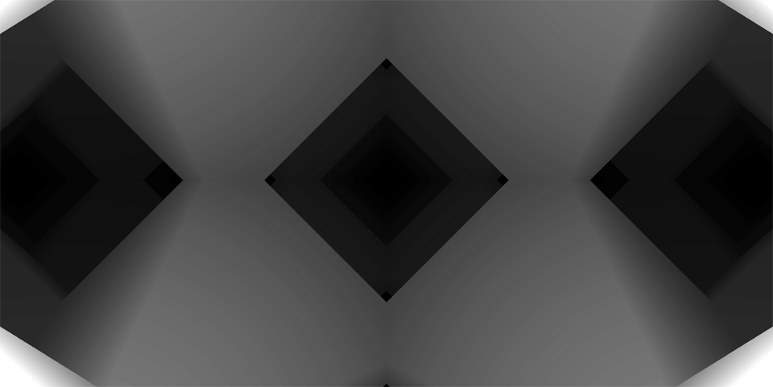
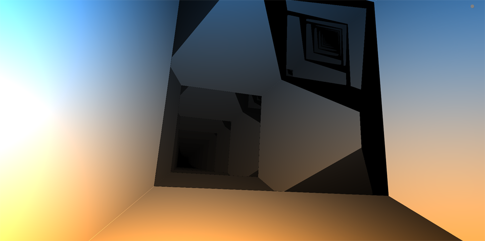
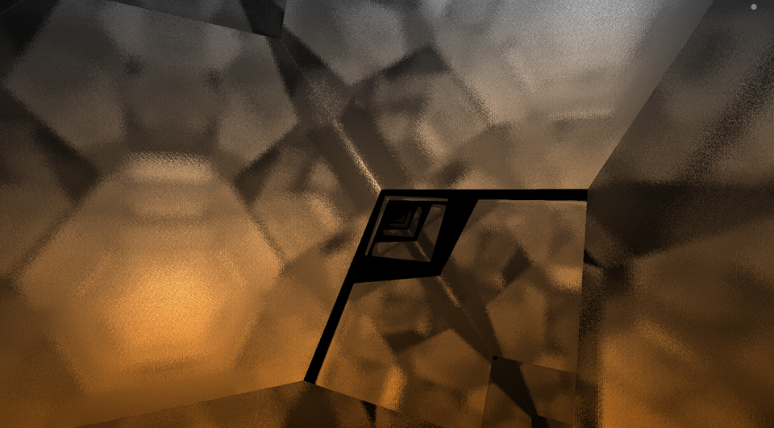

# Shader Advent 2024: Micro Shaders

*Published on December 20th, 2024*

## Introduction:

This article is about writing micro shaders. Small pieces of minimal shadercode that can be used for either smaller intro sizes (like 4k, 1k, 512 or even 256 byte intros), or for a livecoding setting where you are able to setup your code quickly and build out from there, so that both yourself and the audience are comfortable with the progression.

These setup codes and shortcuts are useful because of their size as well as they are easy to remember by heart when used in a livecoding setting. This tutorial assumes original OpenGL/core code, but can also easily be adapted to WebGL which is a little stricter with float/int casting. So without further ado lets get into it...

## Minimal Raymarching loop:

So just to get something on the screen quickly, let us start with a very basic mimimalistic raymarching setup like so.

```glsl
uniform float time;
float l,z,d,i,t=time;

float S(vec3 p){p=mod(p,2)-1;return dot(p,sign(p))-1.5;}

void main(){
vec2 uv=gl_FragCoord.xy/960.-vec2(1,.6);
vec3 p=vec3(0,0,t),r=normalize(vec3(uv,1.));
for (i=0,z=0,l=0,d=1;i++<99;p+=r*(d=S(p)/2),z+=d) if (d<1e-5) break;
gl_FragColor=vec4(1/z);
}
```

Asuming a fixed resolution of 1920x1080 for UV space, the code above consists of setting start position `p` and extracting a raydirection `r` from UV coordinates. As well as a single line raymarching loop that calls our `float S(p)` SDF function.



Instead of using a sphere function for the SDF (`d=length(p)-radius`) i'm picking a simple domain-repeated octahedron shape instead for slightly less uniformity. Once we have a hit we take the one over total z-value to determine the color value.

## Adding Shading, Rotation and Color

So now we have a basic marcher up and running, lets modify it a little bit to add some camera rotation, shading and color.

```glsl
uniform float time;
float l,z,d,i,t=time;

mat2 R(float a){return mat2(cos(a),-sin(a),sin(a),cos(a));}
float S(vec3 p){p=mod(p,2)-1;return dot(p,sign(p))-1.5;}

void main(){
vec2 uv=gl_FragCoord.xy/960.-vec2(1,.6);
vec3 p=vec3(0,0,t),r=normalize(vec3(uv,1.)),e=vec3(.001,0.,0.),n;
r.xy*=R(t/7);r.xz*=R(t/9);
for (i=0,z=0,l=0,d=1;i++<99;p+=r*(d=S(p)/2),z+=d){
    if (d<1e-5) {n=normalize(d-vec3(S(p-e),S(p-e.yxy),S(p-e.yyx)));l=pow(max(0,dot(-r,n)),2);break;}
}
gl_FragColor=vec4(vec3(1-uv.y,1,1+uv.y)*l/z,1);
}
```

As you can see above i've added a small rotation function R that I use to rotate our camera/ray direction (`r.xy*=R(t/7);r.xz*=R(t/9);`). To get some proper shading, we need to extract a normal `n` as well and use that to calculate a very basic diffuse/specular lighting by taking the dot-product between the extracted normal and the ray-direction.



Lastly, i've added a little orange/blue vertical color-gradient to the overall image (`vec3(1-uv.y,1,1+uv.y)`) to add a little color to the overall picture.

## Adding some reflection and vignetting:

Now while the above code looks somewhat passable, you will still not blow any minds in your shaderjam/showdown. To add some flair i've developed a small 2-liner hashed-reflection method that will give your visuals a little oompf.

```glsl
uniform float time;
float l,z,d,i,t=time;

vec3 H(vec3 p) {return fract(sin(p*847+p.yzx*463+p.zxy*697)*492);}
mat2 R(float a){return mat2(cos(a),-sin(a),sin(a),cos(a));}
float S(vec3 p){p=mod(p,2)-1;return dot(p,sign(p))-1.5;}

void main(){
vec2 uv=gl_FragCoord.xy/960.-vec2(1,.6);
vec3 p=vec3(0,0,t),r=normalize(vec3(uv,1.)),e=vec3(.001,0.,0.),n;
r.xy*=R(t/7);r.xz*=R(t/9);
for (i=0,z=0,l=0,d=1;i++<99;p+=r*(d=S(p)/2),z+=d){
    if (d<1e-5) {
        n=normalize(d-vec3(S(p-e),S(p-e.yxy),S(p-e.yyx)))+H(p)/99;
        p+=n/2;l+=pow(max(0,dot(-r,n)),6);r=reflect(r,n);
    }
}
float v=1-length(uv)/2;
gl_FragColor=vec4(vec3(1-uv.y,1,1+uv.y)*v*l/z,1);
}
```

For starters, i've added a fairly basic 3in-1out hash function H to use in our hashed reflection.

Then from here:
1. I'm adding a positional hash to the normal (`+H(p)/99`)
2. Step out of the SDF using the normal (`p+=n/2`)
3. Add the diffuse-specular lighting from the previous step to the lightvalue.
4. Reflect the ray-direction using the normal and keep on marching



The above method will just keep bouncing around the scene until you run out of marching-steps. Not the most speed-optimised approach, but it is extremely small to implement.

As a final touch I've added a small vignetting `v=1-length(uv/2);` to soften the edges.

## Conclusion:

I hope you've enjoyed reading this article. I hope this will help you make the visuals for you tiny intro or livecoding session at least somewhat passable without spending hundreds of lines of code. Thanks to Marten Range for setting this up and to all other contributors to this years Shader Advent.
